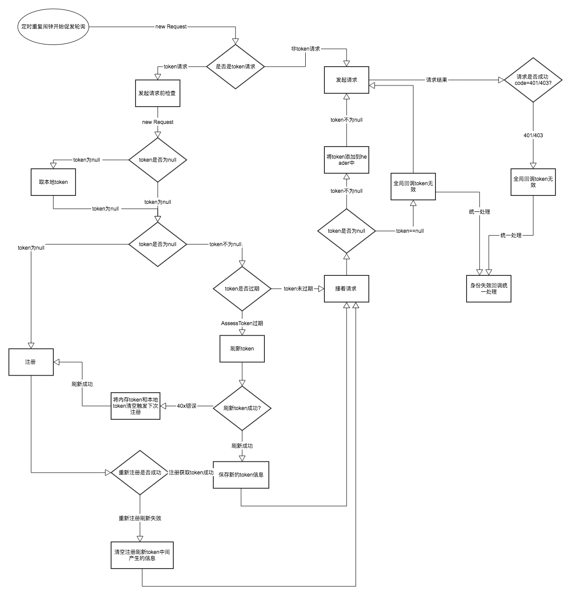

# WSNET


## 支持的请求

id  | class |
----------|-------------|
1| DeleteRequest |
2| GetRequest    |
3| HeadRequest   |
4| OptionsRequest|
5| PatchRequest  |
6| PostRequest   |
7| PutRequest    |
8| TraceRequest  |

## 初始化在Application中：
```java
        //添加公共的header
        HttpHeaders headers = new HttpHeaders();
        headers.put("commonHeaderKey2", "commonHeaderValue2");
        //添加公共的params（可选）
        HttpParams params = new HttpParams();
        params.put("commonParamsKey1", "commonParamsValue1");
        try {
            WSONet.getInstance()
                  .init(this)
                  isDebug("WSONet",true)
                 .setCacheMode(CacheMode.NO_CACHE)
                .setCacheTime(CacheEntity.CACHE_NEVER_EXPIRE)
                .addCommonHeaders(headers)                                         //设置全局公共头
                .addCommonParams(params);                                          //设置全局公共参数
        } catch (Exception e) {
            e.printStackTrace();
        }
```

## 身份过期回调接口：

```java
        public interface LoginExpireCallBack {
            /**
             * 全局身份过期回调
             * @param tag 每个请求的tag ,可以通过tag可以区分哪个请求
             * @param code 每个请求回调的code  当请求前检查token==null时code=-1,请求后拦截请求会返回对应的code,403/401
             */
            void LoginExpire(String tag,int code);
        }
```
## 身份过期回调使用：

```java
    WSONet.getInstance().setLoginExpireCallBack(new LoginExpireCallBack() {
             @Override
             public void LoginExpire(String tag, int code) {
                   //身份过期 可以根据 tag和code 区分请求
             }
         });
```

## 身份认证的简要流程图：



## 求使用例子：

```java
           WSONet.<ConfigurationBean>get(
                              Ip + "/api/device-mgt/android/v1.0/configuration")
                              .execute(new JsonCallback<ConfigurationBean>() {
                                  /**
                                   * 请求成功，具体code在JsonCallback中定制
                                   * @param response
                                   */
                                  @Override
                                  public void onSuccess(com.want.wso2.model.Response<ConfigurationBean> response) {

                                  }

                                  /**
                                   * 请求错误
                                   * @param response
                                   */
                                  @Override
                                  public void onError(com.want.wso2.model.Response<ConfigurationBean> response) {

                                  }

                                  /**
                                   * 无网络 在发起网络请求之前，检查网络，无网络回调
                                   * @param msg
                                   */
                                  @Override
                                  public void netWorkError(String msg) {

                                  }
                              });
```

## 身份认证：

```java
            /**
             *
             *
             * @param registerUrl
             * @param tokenUrl
             * @param registrationProfileRequest
             * @param userName
             * @param password
             * @param scope
             * @param registerListener
             */
        Authenticator.register(String registerUrl,
                                final String tokenUrl,
                                RegistrationProfileRequest registrationProfileRequest,
                                final String userName,
                                final String password,
                                final String scope,
                                final RegisterListener registerListener)
```

## 断点下载使用示例：

```java
                            //设置下载目录
                             Download download = Download.getInstance();

                             download.setFolder(Environment.getExternalStorageDirectory().getAbsolutePath() + "/aaa/");
                             //自定义设置下载线程池
                             download.getThreadPool().setCorePoolSize(3);
                             //获取断点下载的进度
                             List<Progress> progressList = DownloadManager.getInstance().getAll();
                             //加载所有没有下载完成的任务
                             download.restore(progressList);
                             //开始所有的下载任务
                             download.startAll();
                        GetRequest<File>
                                request =
                                WSONet.<File>get(
                                        "http://121.29.10.1/f5.market.mi-img.com/download/AppStore/0b8b552a1df0a8bc417a5afae3a26b2fb1342a909/com.qiyi.video.apk")
                                        .headers("aaa", "111")
                                        .params("bbb", "222");
                        Download.request("Tag", request)
                                .save()
                                .register(new DownloadListener("Tag") {
                                    /**
                                     * 开始下载监听
                                     * @param progress
                                     */
                                    @Override
                                    public void onStart(Progress progress) {

                                    }

                                    /**
                                     * 下载进度监听
                                     * @param progress
                                     */
                                    @Override
                                    public void onProgress(Progress progress) {

                                    }

                                    /**
                                     * 下载错误监听
                                     * @param progress
                                     */
                                    @Override
                                    public void onError(Progress progress) {

                                    }

                                    /**
                                     * 下载完成监听
                                     * @param file
                                     * @param progress
                                     */
                                    @Override
                                    public void onFinish(File file, Progress progress) {

                                    }

                                    /**
                                     * 移除下载监听
                                     * @param progress
                                     */
                                    @Override
                                    public void onRemove(Progress progress) {

                                    }
                                })
                                .start();
```
## 断点上传：

```java

                Upload uploadTask = Upload.getInstance();
                uploadTask.getThreadPool().setCorePoolSize(3);
                //拿到断点的历史记录开始
                List<Progress> all = UploadManager.getInstance().getAll();
                uploadTask.restore(all);
                //开始所有的任务
                uploadTask.startAll();
                PostRequest<String> postRequest = WSONet.<String>post("url")//
                                                                            .headers("aaa", "111")//
                                                                            .params("bbb", "222")//
                                                                            .params("fileKey",
                                                                            new File("file path"))//
                                                                            .converter(new StringConvert());

                UploadTask<String> task = Upload.request("file path", postRequest)//
                                               .priority(new Random().nextInt(100))//
                                               .extra1("额外的")//
                                               .save();//保存到任务中
                /**
                 * task注册上传监听
                 */
                task.register(new UploadListener<String>("TAG") {
                    @Override
                    public void onStart(Progress progress) {
                    }
                    @Override
                    public void onProgress(Progress progress) {
                    }
                    @Override
                    public void onError(Progress progress) {
                    }
                    @Override
                    public void onFinish(String s, Progress progress) {
                    }
                    @Override
                    public void onRemove(Progress progress) {
                    }
                });
                //开始上传
                task.start();
                /**
                 * 设置全局监听
                 */
                uploadTask.addOnAllTaskEndListener(new XExecutor.OnAllTaskEndListener() {
                    @Override
                    public void onAllTaskEnd() {

                    }
                });
                /**
                 * 移除所有任务
                 */
                Upload.getInstance().removeAll();

```

## 混淆配置

                -dontwarn okhttp3.**
                -dontwarn okio.**
                -dontwarn javax.annotation.**
                # A resource is loaded with a relative path so the package of this class must be preserved.
                -keepnames class okhttp3.internal.publicsuffix.PublicSuffixDatabase

                # For using GSON @Expose annotation
                -keepattributes *Annotation*

                # Gson specific classes
                -keep class sun.misc.Unsafe { *; }
                -keep class com.google.gson.stream.** { *; }

                # Application classes that will be serialized/deserialized over Gson
                -keep class com.google.gson.examples.android.model.** { *; }

                -keep class com.want.wso2.** { *; }
